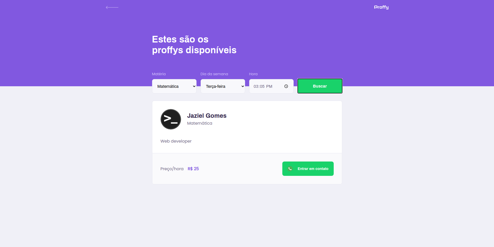
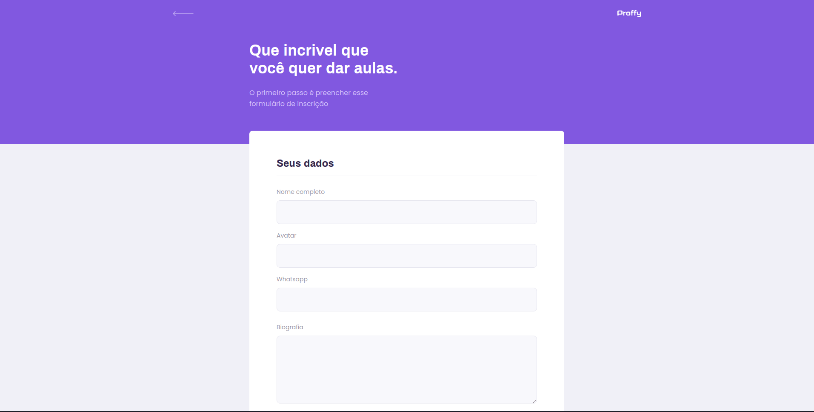

# Rocketseat Next Level Week #2

<h1 align="center">
    
    
    
</h1>

<h1 align="center">
    
    
    
    
    
</h1>

## 💻 Projeto

Projeto desenvolvido no evento "Next Level Week 2" da [Rocketseat](https://rocketseat.com.br/).

O Proffy é uma plataforma de estudos online que ajuda pessoas a encontrarem professores online.

## :rocket: Tecnologias

Esse projeto foi desenvolvido com as seguintes tecnologias:

- [Node.js](https://nodejs.org/en/)
- [TypeScript](https://www.typescriptlang.org/)
- [React](https://pt-br.reactjs.org/)
- [React Native](https://reactnative.dev/)
- [Expo](https://expo.io/)

## :information_source: Como usar

Para clonar essa aplicação, você vai precisar de [Git](https://git-scm.com/), Node.js v12 e [Yarn](https://yarnpkg.com/) instalado.

### Instalar API

```bash
# Diretório da API
cd server

# Instalar dependências
yarn install

# Rodar migração para criar um banco de dados SQLite em server/src/database
yarn knex:migrate

# Iniciar servidor rodando na porta 3333
yarn start
```

### Instalar Frontend

```bash
# Diretório do frontend
cd web

# Instalar dependências
yarn install

# Iniciar aplicação rodando na porta 3000
yarn start
```

### Instalar Mobile

```bash
# Diretório do mobile
cd mobile

# Instalar dependências
yarn install

# Iniciar aplicação no Expo
yarn start
```

## 🤔 Desafio para melhorar a aplicação

`https://www.notion.so/Vers-o-2-0-Proffy-eefca1b981694cd0a895613bc6235970`

## :memo: Licença

Esse projeto está sob a licença MIT. Veja o arquivo [LICENSE](LICENSE.md) para mais detalhes.

---

<sup>Projeto desenvolvido com a tutoria de [Diego Fernandes](https://github.com/diego3g), da [Rocketseat](https://rocketseat.com.br/).</sup>
