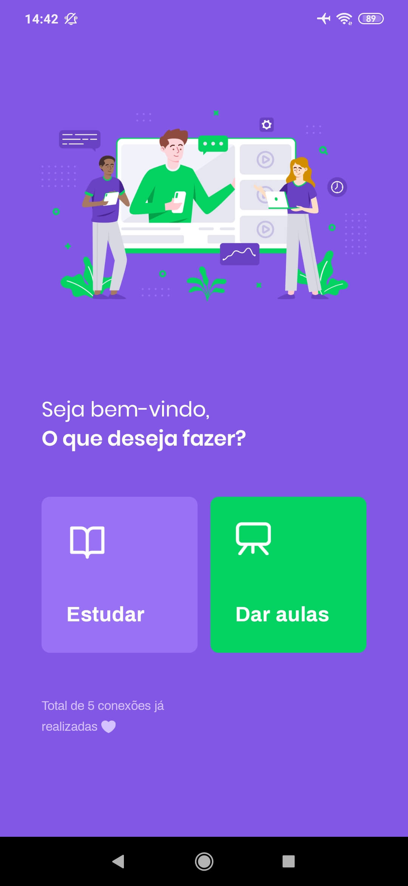
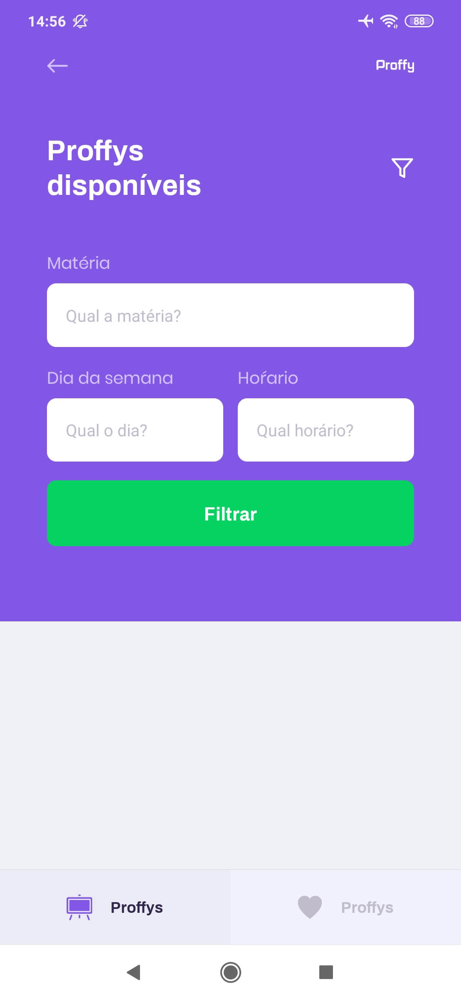
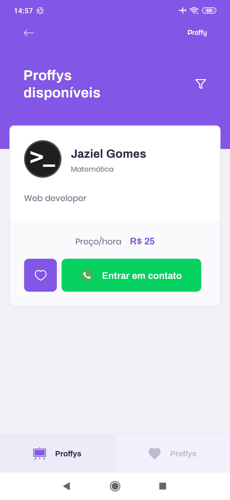

# Rocketseat Next Level Week #2

<h1 align="center">
    
    
    
</h1>

<h1 align="center">
    
    
    
    
    
</h1>

## :rocket: Tecnologias

Esse projeto utiliza as seguintes tecnologias:

- Node.js
- TypeScript
- React
- React Native
- Expo

## :information_source: Como usar

Para clonar essa aplicação, você vai precisar de Git, Node.js v12 e Yarn instalado.

### Instalar API

```bash
# Diretório da API
cd server

# Instalar dependências
yarn install

# Rodar migração para criar um banco de dados SQLite em server/src/database
yarn knex:migrate

# Iniciar servidor rodando na porta 3333
yarn start
```

### Instalar Frontend

```bash
# Diretório do frontend
cd web

# Instalar dependências
yarn install

# Iniciar aplicação rodando na porta 3000
yarn start
```

### Instalar Mobile

```bash
# Diretório do mobile
cd mobile

# Instalar dependências
yarn install

# Iniciar aplicação no Expo
yarn start
```

## Desafio para melhorar a aplicação

`https://www.notion.so/Vers-o-2-0-Proffy-eefca1b981694cd0a895613bc6235970`
